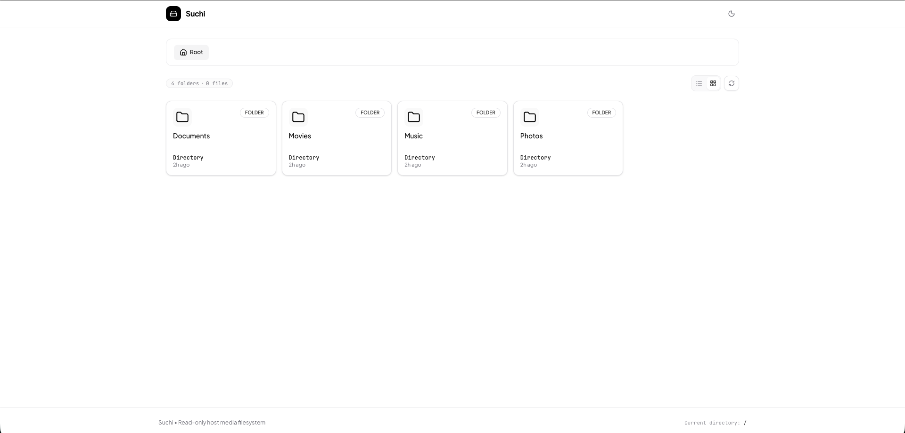
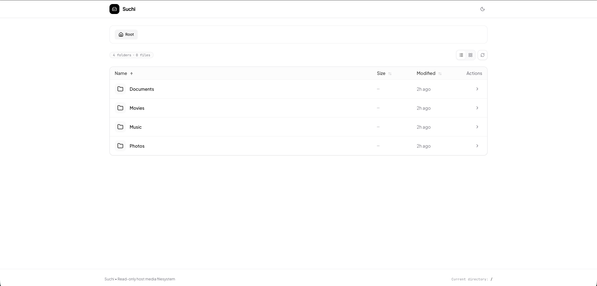
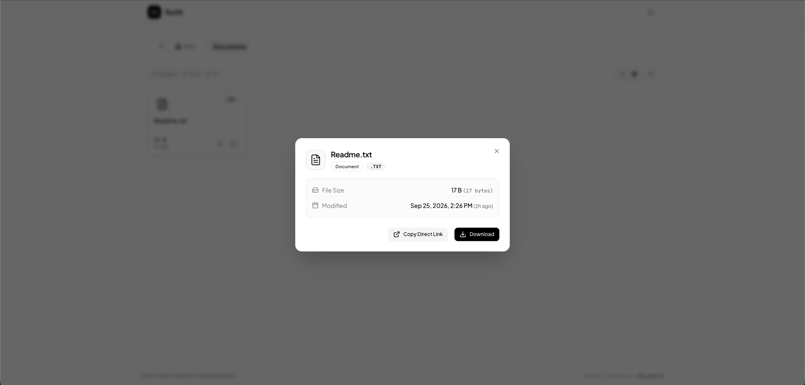
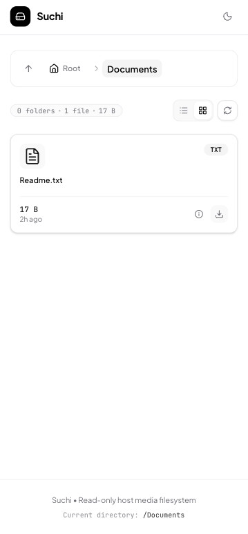

# Suchi

[](https://github.com/GoravG/suchi/actions/workflows/ci.yml)
[](https://github.com/GoravG/suchi/actions/workflows/ci.yml)
[](https://hub.docker.com/r/goravg/suchi)
[](https://golang.org)
[](LICENSE)

A lightweight, ultra-minimal self-hosted web file browser designed to browse and stream mounted media trees on home servers and NUCs.

Built with a **Go** backend and a **React 19 + Tailwind CSS v4** frontend, packaged into a single standalone static binary with zero external dependencies.

---

## Highlights

- **Ultra-Lightweight & Fast:** Single binary compilation with frontend embedded via `go:embed`.
- **Minimalist Aesthetic:** High-contrast monochrome black & white design inspired by modern minimalist interfaces.
- **Fully Responsive:** Seamless layout adaptation for desktop, tablet, and mobile browsers.
- **Security-First & Read-Only:** Mounted media trees remain read-only (`:ro`) with built-in path-traversal protections.
- **File Inspector & Previews:** In-browser media playback (video, audio, images), metadata inspection, and instant download links.
- **Resilient Direct Links:** One-click copy for direct download links with automatic fallback for non-secure LAN IP contexts (e.g. `http://192.168.x.x:8080`).

---

## Screenshots

| Desktop Grid View | Desktop Table View |
| :---: | :---: |
|  |  |

| File Inspector Modal | Responsive Mobile View |
| :---: | :---: |
|  |  |

---

## Resource Footprint & Metrics

| Metric | Typical Value | Notes |
| :--- | :--- | :--- |
| **Docker Image Size** | **~9.5 MB** | Multi-stage build deployed `FROM scratch` (0 MB OS overhead, 0 CVE attack surface) |
| **Memory Usage (RAM)** | **~10 – 20 MB** | Lightweight Go runtime footprint under typical loads |
| **Idle CPU** | **< 0.1%** | Event-driven HTTP server with no heavy background pollers |
| **Binary Size** | **~9.3 MB** | Fully self-contained (Go binary + embedded React production bundle) |

---

## Quickstart with Docker

### 1. Using Docker Compose (Recommended)

1. Clone the repository:
   ```bash
   git clone https://github.com/goravg/suchi.git
   cd suchi
   ```

2. Configure your media path in [docker-compose.yml](docker-compose.yml) or set the environment variable:
   ```bash
   export SUCHI_MEDIA_PATH="/path/to/your/media"
   docker compose up -d --build
   ```

3. Open your browser at:
   ```
   http://localhost:8081
   ```

### 2. Using Docker CLI Directly

Build the minimal image:
```bash
docker build -t suchi .
```

Run the container:
```bash
docker run -d \
  --name suchi \
  -p 8081:8080 \
  -v /path/to/your/media:/data:ro \
  --restart unless-stopped \
  suchi
```

---

## Configuration & Environment Variables

| Variable | Default | Description |
| :--- | :--- | :--- |
| `SUCHI_DATA_ROOT` | `/data` | Path to the directory inside the container/host to serve files from |
| `SUCHI_ADDR` | `:8080` | Listen address and port (e.g. `:8080` or `127.0.0.1:8080`) |
| `SUCHI_MEDIA_PATH` | `./data` | Host directory path mounted into `/data:ro` in `docker-compose.yml` |

---

## Local Development (Without Docker)

### Prerequisites
- **Go 1.23+**
- **Node.js 20+** & **npm**

### Step 1: Build the Frontend
```bash
cd frontend
npm install
npm run build
```
The compiled SPA bundle will be placed automatically in `backend/static/`.

### Step 2: Run the Backend
```bash
cd ../backend
SUCHI_DATA_ROOT="/path/to/media" SUCHI_ADDR=":8080" go run .
```

Visit `http://localhost:8080` in your browser.

### Active Frontend Development (Hot Reload)
To develop the frontend with Vite hot-module replacement (HMR):
```bash
# Terminal 1: Run the Go backend API
cd backend
SUCHI_DATA_ROOT="/path/to/media" SUCHI_ADDR=":8080" go run .

# Terminal 2: Run Vite dev server (proxies /api to :8080)
cd frontend
npm run dev
```
Visit Vite's local dev URL (usually `http://localhost:5173`).

### Running Tests

Run the backend and frontend unit test suites:

```bash
# Run backend Go unit tests with coverage
cd backend
go test -v -race -cover ./...

# Run frontend Vitest test suite
cd ../frontend
npm test
```

---

## Project Structure

```
suchi/
├── Dockerfile                  # Multi-stage build producing a ~9.5MB `scratch` image
├── docker-compose.yml          # Container deployment specification
├── backend/                    # Go HTTP backend (Go 1.23)
│   ├── main.go                 # Router, path validation & /api/files endpoint
│   ├── download.go             # /api/files/download streaming handler
│   ├── static.go               # SPA server utilizing go:embed
│   └── models/                 # Request/response structs
└── frontend/                   # React 19 + TypeScript + Tailwind CSS v4
    ├── src/
    │   ├── components/         # UI components & responsive views (Table/Grid)
    │   │   └── ui/             # Reusable Shadcn UI primitives
    │   ├── hooks/              # Custom data fetching & theme hooks
    │   ├── services/           # Typed API service client
    │   └── utils/              # Formatting & clipboard helpers
    └── vite.config.ts          # Vite build config with outDir to backend/static
```

---

## License

MIT
